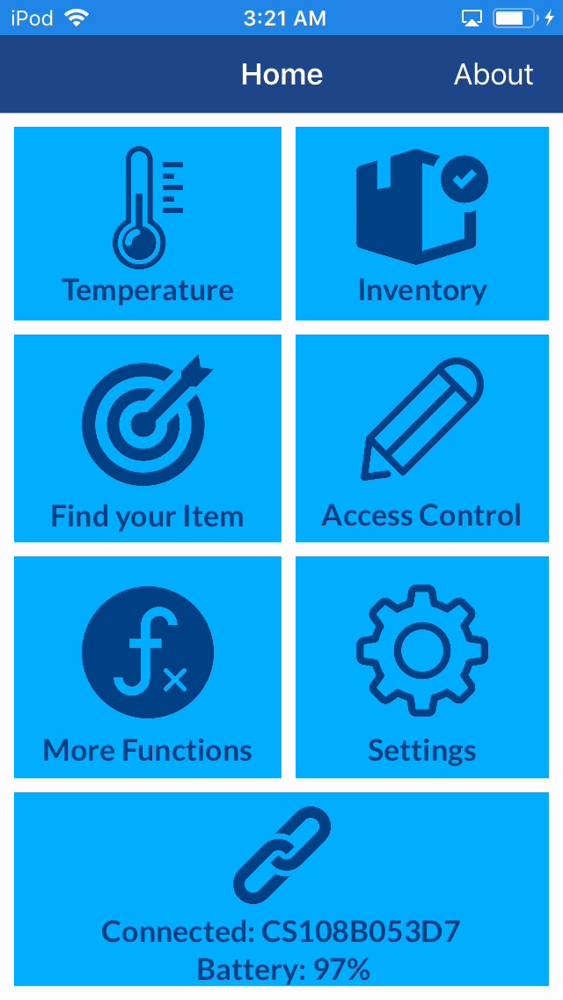
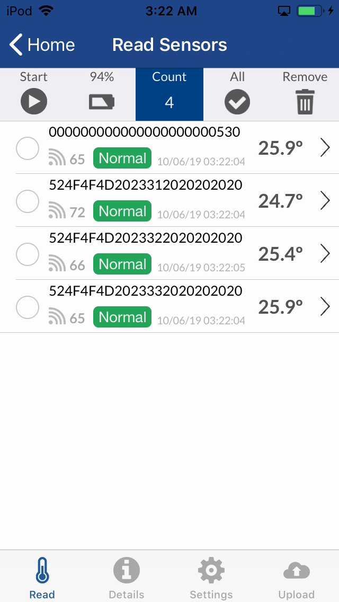
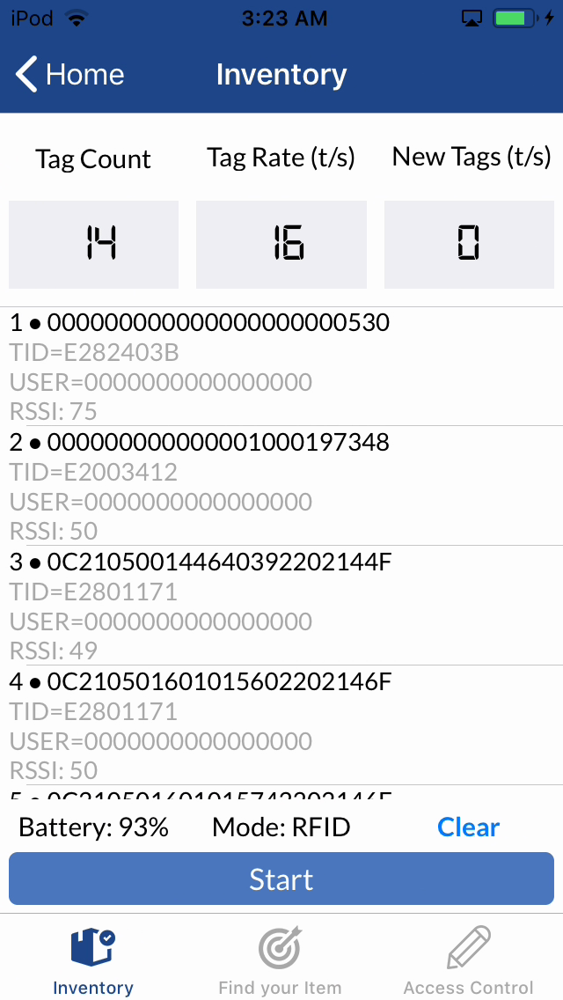
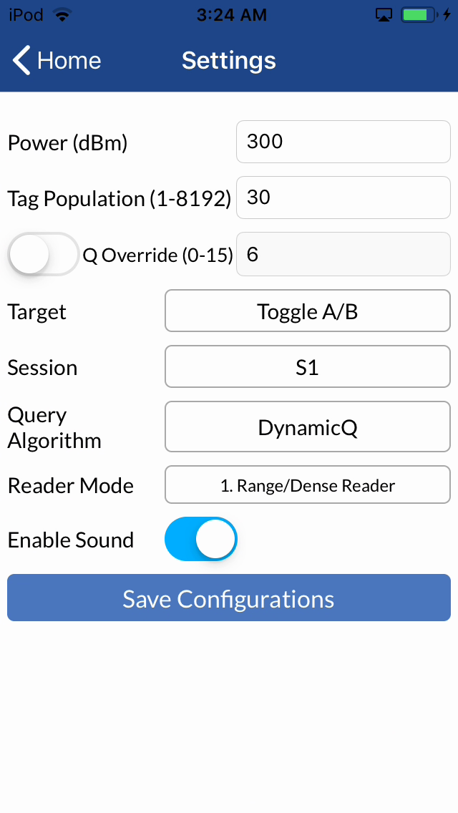

# CS108-iOS-Swift-App

```diff
- This repo is still under development and please check back again later for the official release.
- Please do not take any of the code in this repo for production use.
```
Library and demo app for Convergence Systems Limited CS108 UHF RFID handheld reader written in Swift.  All features are exactly the same as Objective-C version except the View Controllers are rewritten in Swift.  The data model and reader connector (CSLReader classes) remains the same with Swift and in common with the Objective-C project.

[Product Information](https://www.convergence.com.hk/cs108/)
<br><br>
&nbsp;<br>&nbsp;
<br><br>

## Development Environment
- XCode 9
- iOS 11
- Tested on iPhone 8 (optimized for 4.7" but functional on all screen sizes) 
